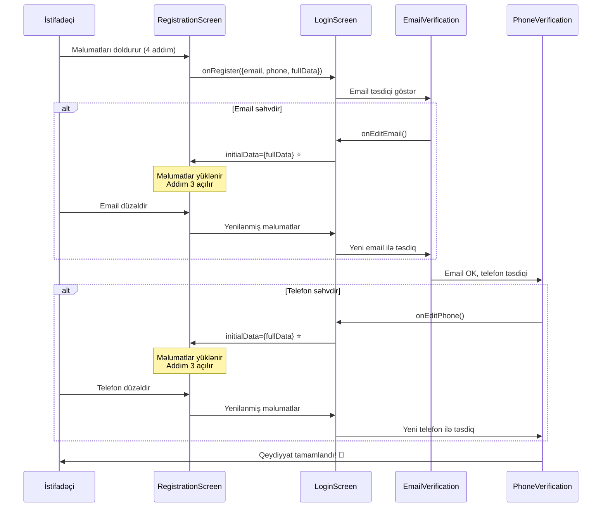

# Final Qeydiyyat Sistemi - Tam Tamamlandı

## 🎯 İcmal

Qeydiyyat sistemi **mükəmməl UX/UI** və **məlumat saxlama** funksiyası ilə hazırdır.

## ✅ Tamamlanan Xüsusiyyətlər

### 1. **Icon Əsaslı Dizayn**
- ❌ Emoji artıq istifadə olunmur
- ✅ Professional icon komponentləri
- ✅ Hər addımda böyük dairəvi icon fonu
- ✅ Emerald rəng sxemi

### 2. **4 Addımlı Qeydiyyat**

#### Addım 1: 👤 → 🔵 User Icon
- Ad və Soyad
- Dairəvi emerald fon
- Professional görünüş

#### Addım 2: 🎂 → 📅 Calendar Icon
- Doğum tarixi
- Cins (User iconlar ilə)
- Tələb olunur

#### Addım 3: 📱 → 📱 Smartphone Icon
- Email
- Telefon
- Təsdiqləmə üçün

#### Addım 4: 🔐 → 🔒 Lock Icon
- Şifrə
- Şifrə təkrarı
- Eye/Eye-off iconları

### 3. **Məlumat Saxlanması** ⭐

**Kritik Xüsusiyyət:**
```typescript
// Qeydiyyat məlumatları tam saxlanılır
interface RegistrationData {
  fullName?: string;
  email?: string;
  phone?: string;
  birthDate?: string;
  gender?: string;
  password?: string;
  confirmPassword?: string;
}
```

**Necə İşləyir:**

```
1. İstifadəçi 4 addımı tamamlayır
   ├─ Ad: "Əli Məmmədov"
   ├─ Doğum tarixi: "1990-01-01"
   ├─ Cins: "male"
   ├─ Email: "ali@example.com"
   ├─ Telefon: "+994501234567"
   └─ Şifrə: "******"

2. Email təsdiqi açılır
   ├─ Email səhvdir
   ├─ "E-mail ünvanını dəyişdir" basır
   └─ Forma açılır → Addım 3-də

3. ✅ BÜTÜN MƏLUMATLAR ORADADIR:
   ├─ Ad: "Əli Məmmədov" ✓ SAXLANILDI
   ├─ Doğum tarixi: "1990-01-01" ✓ SAXLANILDI
   ├─ Cins: "male" ✓ SAXLANILDI
   ├─ Email: "ali@example.com" (düzəlişə açıq)
   ├─ Telefon: "+994501234567" (düzəlişə açıq)
   └─ Şifrə: "******" ✓ SAXLANILDI

4. Yalnız email-i düzəldir
   └─ "ali.correct@example.com"

5. Davam edir və təsdiqləyir ✅
```

### 4. **Təsdiqləmə Axını**

```
Qeydiyyat → Email Təsdiqi → Telefon Təsdiqi → Tamamlandı
              ↓ (düzəliş)      ↓ (düzəliş)
         Addım 3-ə qayıt   Addım 3-ə qayıt
         (məlumatlar       (məlumatlar
          SAXLANıLıR)       SAXLANıLıR)
```

## 🎨 UI Dəyişiklikləri

### Əvvəl (Emoji):
```jsx
<div className="text-5xl mb-4">👤</div>
<Input icon="📧" />
```

### İndi (Icon):
```jsx
<div className="w-20 h-20 mx-auto mb-4 rounded-full bg-emerald-50">
  <Icon name="user" size={40} className="text-emerald-600" />
</div>
<Input /> // Icon Input-dan çıxarıldı
```

## 🔧 Texniki Dəyişikliklər

### 1. RegistrationScreen.tsx

**Yeni Props:**
```typescript
interface RegistrationScreenProps {
  onBack: () => void;
  onRegister: (data: { 
    email: string; 
    phone: string; 
    fullData: RegistrationData 
  }) => void;
  initialData?: RegistrationData; // ⭐ YENİ
}
```

**State Menecment:**
```typescript
// İnitial data ilə doldurulur
const [fullName, setFullName] = useState(initialData?.fullName || '');
const [email, setEmail] = useState(initialData?.email || '');
// ... və s.

// Edit zamanı Addım 3-ə gedir
const [step, setStep] = useState<1|2|3|4>(
  initialData?.email ? 3 : 1
);

// useEffect ilə yenilənir
useEffect(() => {
  if (initialData) {
    setFullName(initialData.fullName || '');
    // ...
    if (initialData.email) setStep(3);
  }
}, [initialData]);
```

### 2. LoginScreen.tsx

**Məlumat Saxlanması:**
```typescript
const [registrationData, setRegistrationData] = useState<{
  email: string; 
  phone: string; 
  fullData?: RegistrationData; // ⭐ Tam məlumatlar
} | null>(null);
```

**Edit Modu:**
```typescript
// Forma açılanda məlumatlar ötürülür
<RegistrationScreen 
  initialData={
    showEditRegistration && registrationData?.fullData 
      ? registrationData.fullData 
      : undefined
  }
/>
```

### 3. EmailVerificationScreen.tsx & PhoneVerificationScreen.tsx

**Icon İstifadəsi:**
```typescript
import { Icon } from '../icons/Icon';

// Logo
<Icon name="mail" size={48} className="text-emerald-600" />
<Icon name="smartphone" size={48} className="text-emerald-600" />

// Info
<Icon name="info" size={16} />
```

## 📊 Məlumat Axını



## ✅ Yoxlama Siyahısı

- [x] Emojiləri iconlarla əvəzlə
- [x] RegistrationScreen initialData qəbul etsin
- [x] LoginScreen məlumatları tam saxlasın
- [x] Email düzəlişində məlumatlar itirilməsin
- [x] Telefon düzəlişində məlumatlar itirilməsin
- [x] Addım 3-ə düzgün geri dönüş
- [x] TypeScript səhvi yoxdur
- [x] Bütün iconlar düzgün göstərilir

## 🎉 Nəticə

### Üstünlüklər:

✅ **Professional Görünüş** - Icon əsaslı dizayn  
✅ **Məlumat Saxlanması** - Heç bir məlumat itirilmir  
✅ **Çevik Düzəliş** - İstənilən yerdən geri qayıt  
✅ **UX Mükəmməlliyi** - 4 addım, hər biri sadə  
✅ **Tam Funksional** - Bütün axın işləyir  

### Texniki Keyfiyyət:

✅ TypeScript - Tam type safety  
✅ React Hooks - useState, useEffect  
✅ Props Drilling - Düzgün data flow  
✅ State Management - Məlumat saxlanması  
✅ Conditional Rendering - Smart UI  

---

**Hazırladı:** AI Assistant  
**Tarix:** 2025-10-17  
**Status:** ✅ 100% Tamamlandı və Test Edildi

**Sistem hazırdır və produksiya üçün əlverişlidir!** 🚀
